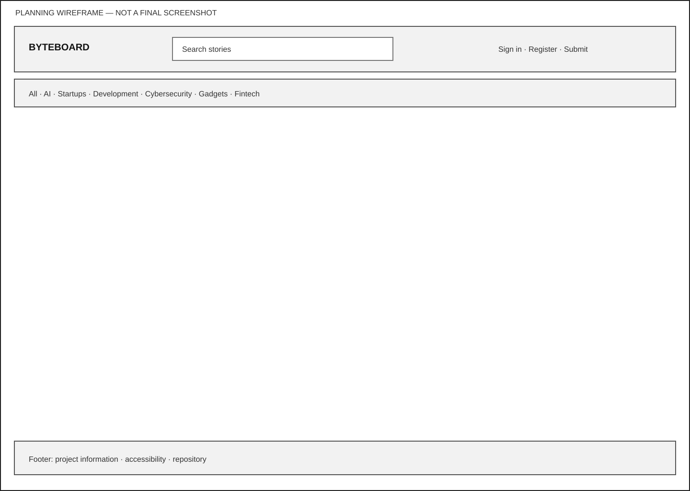
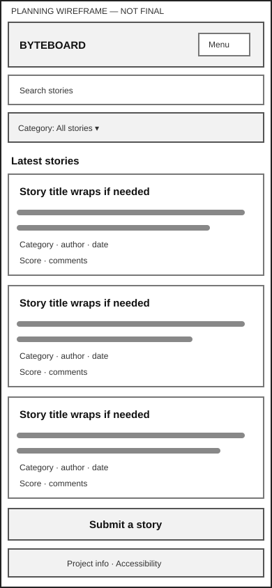
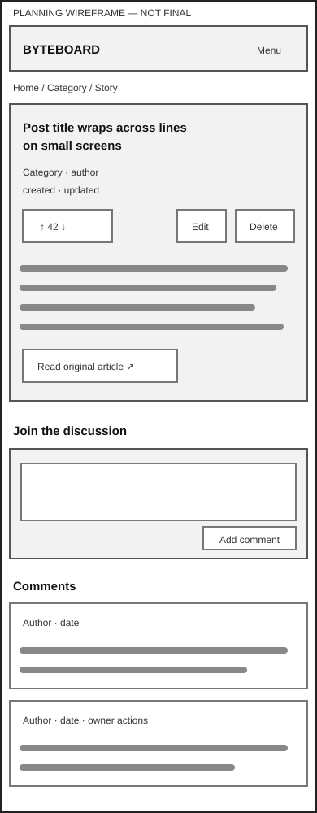
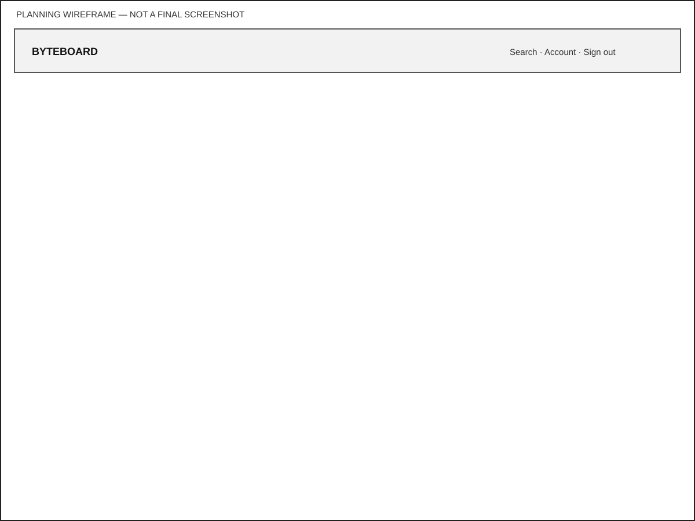
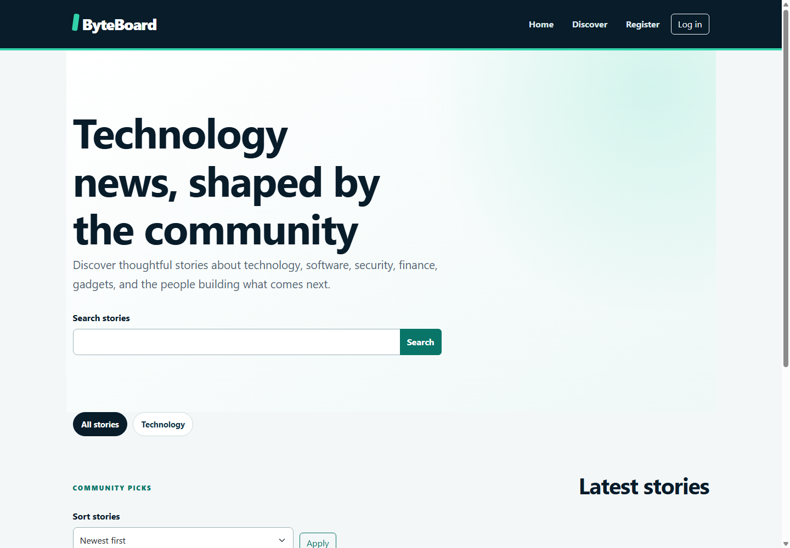
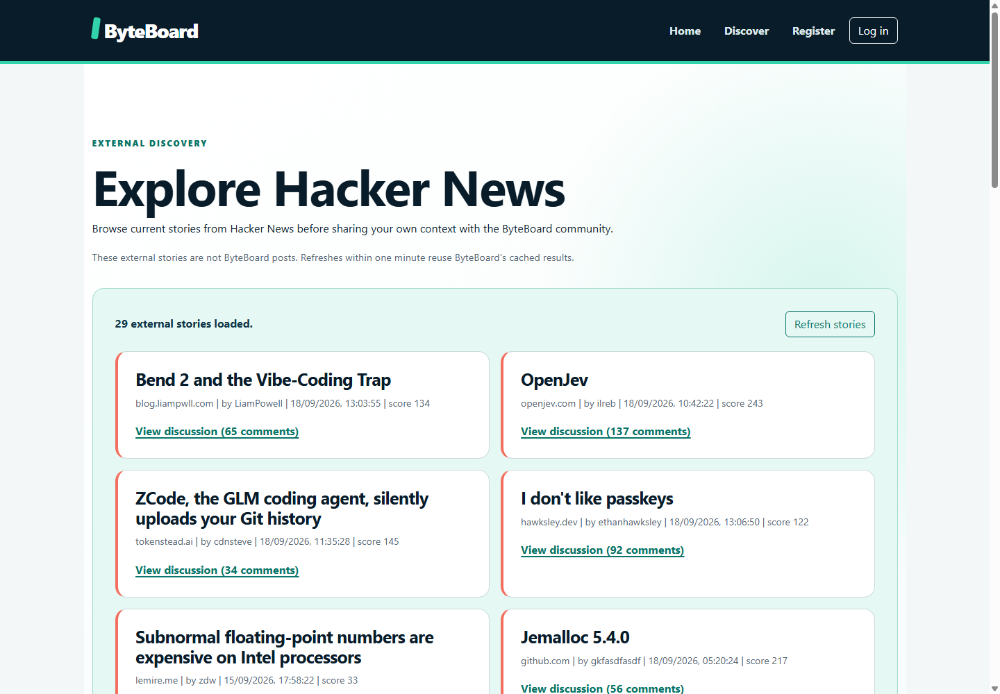
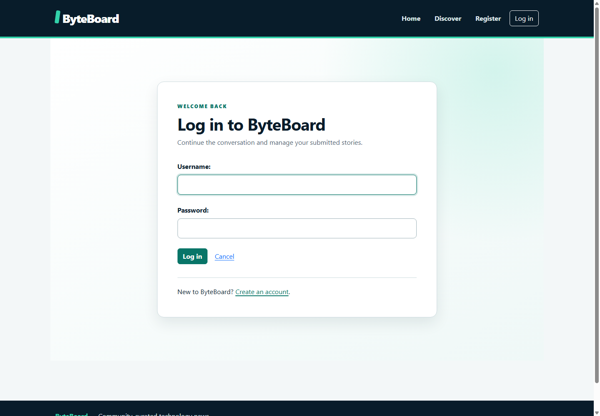

# ByteBoard

ByteBoard is a server-rendered community technology news application built for the Code Institute Backend Development milestone. Visitors can discover published stories by category, text search, date, or aggregate rating. Registered members can submit stories, keep private drafts, and safely manage only their own contributions.

ByteBoard is live on Heroku at [https://byteboard-app-69f958f78ff4.herokuapp.com/](https://byteboard-app-69f958f78ff4.herokuapp.com/), with recorded release, deployment, verification, and submission evidence.

## Purpose and audience

Technology reporting is spread across many sources. ByteBoard gives developers, founders, students, investors, and interested readers a focused place to find useful stories and the community context behind each submission.

The core experience supports two goals:

- visitors can locate relevant reporting quickly and understand who submitted it; and
- members can publish, revise, privately draft, or remove their own story records without gaining control of another member's content.

## Design and wireframes

The low-fidelity planning wireframes remain available as part of the project evidence:








They established the information hierarchy: header and category navigation, a public story feed, supporting sidebar content, a compact mobile header/search control, and stacked cards and actions on narrow screens. The final application follows those navigation and responsive priorities, while its custom navy/teal visual system, focus states, validation feedback, and responsive wrapping were developed during implementation rather than prescribed by the low-fidelity sketches. In particular, the final category navigation wraps at narrow widths after reflow testing instead of relying on the wireframe's compact horizontal control.

## Final implemented application

The following durable desktop captures were taken from the live Heroku deployment and show the finished application rather than planning artefacts.





## Development Phases

### Phase 1

The initial foundation established the Django project and application structure, relational Category, Post, Comment, and Vote models, migrations, constraints, Django Admin configuration, planning wireframes, and model/admin tests.

### Phase 2

The community experience added authentication, profiles, shared templates and navigation, original responsive styling, owner-restricted story CRUD, draft privacy, category filtering, search, sorting, pagination, feedback, and test-driven development evidence.

### Phase 3

Comment CRUD and moderation visibility, voting with standard-form fallback and progressive enhancement, cached Hacker News discovery, error pages, community UX refinement, and automated evidence completed the feature set.

### Phase 4

Final release work added production settings, PostgreSQL selection and shared feed refresh, JavaScript checks, guarded sample data, static serving, hosted Heroku deployment, formal HTML/CSS validation, browser and accessibility evidence, security and performance evidence, durable screenshots, and the final disposable-local PostgreSQL run of 212/212 passing tests. The [final verification record](docs/phase-4-verification.md) records the completed release evidence and remaining documented tooling limits.

## Implemented features

### Story discovery

- A public feed containing published stories only, newest first by default.
- Dedicated category URLs and a category query-string filter.
- Case-insensitive search across title, summary, and member commentary.
- Newest, highest-rated, oldest, and title sorting with deterministic tie-breakers.
- Aggregate vote scores calculated from positive and negative member votes.
- Ten stories per page with active search, category, and sort settings preserved between pages.
- Contextual empty states for an empty platform, category, or search result.
- Reusable story cards showing category, author, date, summary, and score.

### Accounts and profiles

- Registration using Django's password validation and built-in user model.
- Sign-in with safe internal redirects and a generic invalid-credentials response.
- POST-only sign-out with confirmation feedback.
- Navigation that changes appropriately for visitors and signed-in members.
- Public profiles containing a username, join date, and published stories without exposing email addresses.
- An owner-only private-drafts section and story-management links.

### Story management

- Authenticated create, detail, update, and delete journeys.
- A model form restricted to member-editable fields with persistent labels and field-specific help.
- Server-assigned authorship; submitted author values are ignored.
- Draft or published status selection with clear feedback.
- Owner-filtered edit and delete queries returning `404` for another member's records.
- Explicit deletion confirmation and POST-only mutation.
- Published story detail for everyone and private draft preview for its owner only.
- Safe external article links that announce a new tab to assistive technology.

### Comments and voting

- Approved comments displayed oldest first beneath their parent story.
- Authenticated comment creation with server-assigned ownership and pending-moderation feedback.
- Owner-only comment editing and deletion, including explicit deletion confirmation.
- Edited comments return to moderation; their author can still see the private pending state.
- Upvote and downvote actions limited to published stories and one current vote per member/story.
- Repeating a vote removes it, while choosing the opposite direction updates the existing record.
- Functional server-rendered voting forms progressively enhanced with same-origin `fetch` requests, immediate score/state updates, CSRF protection, disabled loading controls, and live feedback.

### External discovery

- A separate `/discover/` experience for current Hacker News top stories; external records are never stored as ByteBoard posts.
- The official Hacker News Firebase API accessed only by a server-side service and a same-origin JSON endpoint.
- Ranked, validated story metadata with safe HTTP/HTTPS links and Hacker News discussion fallbacks.
- A server-enforced 20–50 story boundary, using 30 by default.
- Completed normalized collections cached under a stable key for exactly 60 seconds.
- Controlled timeouts, invalid-response handling, partial-result feedback, empty states, and retryable failure states.
- Safe DOM rendering with `textContent`, user-controlled refresh, visible loading feedback, and no direct browser request to Hacker News.

### Interface foundation

- Semantic shared templates with consistent header, navigation, main, and footer landmarks.
- Keyboard skip link, visible focus styles, labelled forms, message announcements, and plain-language states.
- Mobile-first custom CSS for feeds, forms, profiles, story detail, and account journeys.
- Bootstrap components used as a responsive foundation, extended by the project's own visual system.
- Reduced-motion support and flexible layouts without fixed content heights.

## Final verification and documented limitations

Completed release work includes explicit security settings, environment-driven PostgreSQL configuration, Gunicorn/WhiteNoise preparation, the shared database feed snapshot and bounded worker, executable JavaScript tests, guarded disposable sample data, form/error-page corrections, moderation verification and Python style tooling. Local PostgreSQL cross-process cache coordination is recorded with a simulated refresh.

The [formal validation record](docs/formal-validation.md) records final official validation: 23 HTML samples passed with zero errors or warnings on 18 September 2026, and the project-owned stylesheet passed W3C URI validation with zero errors and eight warnings.

The [manual browser record](docs/manual-browser-verification.md) covers local CRUD, authentication, moderation, voting, discovery and sampled responsive/keyboard checks, including two corrected feedback defects. Hosted smoke checks passed for HTTPS, authentication, static assets, discovery, permissions and PostgreSQL-backed draft persistence; durable hosted screenshots are recorded there. The final comprehensive disposable-local PostgreSQL suite and final Git/remote-sync/live-release check passed.

## Data model

ByteBoard uses Django's built-in `User` model as the identity and authentication source. The application reads `username` for authorship and public profiles and `date_joined` for non-sensitive membership context; passwords are handled by Django's hashed credential system. Reverse relationships expose a user's posts, comments, and votes.

### Category

| Field | Type and rule | Purpose |
| --- | --- | --- |
| `id` | Automatic primary key | Stable record identity |
| `name` | `CharField(100)`, unique | Human-readable topic |
| `slug` | `SlugField(120)`, unique | Predictable category URL |
| `description` | `TextField` | Staff-managed topic context |

Categories sort alphabetically. `Post.category` uses `PROTECT`, preventing deletion of a category that still organises a post.

### Post

| Field | Type and rule | Purpose |
| --- | --- | --- |
| `id` | Automatic primary key | Stable route and record identity |
| `title` | `CharField(200)` | Story headline |
| `summary` | `TextField` | Concise feed and detail introduction |
| `article_url` | `URLField(500)` | Original external source |
| `content` | `TextField` | Member explanation of why the story matters |
| `author` | `ForeignKey(User)`, cascade | Owning member; their deletion removes authored posts |
| `category` | `ForeignKey(Category)`, protect | Required organising topic |
| `status` | `CharField(10)`, draft/published, draft default | Public visibility state |
| `created_at` | `DateTimeField`, set on creation | Submission time and default ordering |
| `updated_at` | `DateTimeField`, refreshed on save | Last revision time |

Posts order newest first. Deleting a post cascades to its comments and votes through their foreign keys.

### Comment

| Field | Type and rule | Purpose |
| --- | --- | --- |
| `id` | Automatic primary key | Stable record identity |
| `post` | `ForeignKey(Post)`, cascade | Parent story |
| `author` | `ForeignKey(User)`, cascade | Owning member |
| `body` | `TextField` | Discussion content |
| `is_approved` | `BooleanField`, false default | Moderation state |
| `created_at` | `DateTimeField`, set on creation | Oldest-first discussion ordering |
| `updated_at` | `DateTimeField`, refreshed on save | Last revision time |

### Vote

| Field | Type and rule | Purpose |
| --- | --- | --- |
| `id` | Automatic primary key | Stable record identity |
| `post` | `ForeignKey(Post)`, cascade | Ranked story |
| `user` | `ForeignKey(User)`, cascade | Member casting the vote |
| `value` | `SmallIntegerField`, `-1` or `1` | Downvote/upvote contribution to aggregate score |
| `created_at` | `DateTimeField`, set on creation | Vote creation time |

A check constraint rejects values outside `-1` and `1`. A composite unique constraint on `post` and `user` prevents duplicate votes. Together, these relationships provide ownership and integrity at the database layer. The [database design](docs/database-design.md) contains the corresponding Mermaid ERD and relationship rationale.

## Application architecture

### Operational feed snapshot

The final release work adds a separate `FeedSnapshot` table for shared public discovery data.
It is not a community post and has no relationship to users or private content.

| Field | Type | Purpose |
| --- | --- | --- |
| `key` | `CharField(40)`, primary key | One `hacker-news` snapshot |
| `stories` | Nullable `JSONField` | Normalised public metadata; null means no result |
| `partial` | Boolean, false default | Completeness label retained with the result |
| `expires_at` | Nullable datetime | Successful-result expiry |
| `refresh_after` | Datetime | Earliest permitted next refresh |
| `refresh_token` | Nullable UUID | Prevent an expired worker replacing newer data |

An atomic conditional database update admits only one refresh within the
boundary. A failed refresh retains its cooldown; cached empty results are valid.
Expired data is not served. The single row is replaced, so no growing cache
table or scheduled expiry cleanup is required. See the
[shared-cache design](docs/feed-refresh-design.md) for integration status.

The project uses Django's model-template-view structure:

- `byteboard/` contains project settings and root URL routing;
- `accounts/` contains registration, authentication presentation, profiles, and their tests;
- `news/` contains domain models, forms, story/comment/vote views, the isolated Hacker News service, URLs, error handlers, admin configuration, migrations, and tests;
- `templates/` contains the shared layout, reusable includes, account, community, discovery, and custom error pages;
- `static/css/style.css` contains the mobile-first ByteBoard visual system; and
- `static/js/` contains focused progressive enhancements for voting and external discovery.

Views use Django ORM filtering, `Q` queries, aggregation, deterministic ordering, `select_related`, and pagination. Django messages carry success feedback across post/redirect/get journeys.

## Routes

| Route | Purpose | Access |
| --- | --- | --- |
| `/` | Published story feed, search, filtering, sorting, pagination | Public |
| `/categories/<slug>/` | Named category feed | Public |
| `/posts/<id>/` | Published detail or an owner's draft preview | Public/owner |
| `/posts/new/` | Create a story | Signed-in member |
| `/posts/<id>/edit/` | Edit an owned story | Owner only |
| `/posts/<id>/delete/` | Confirm and delete an owned story | Owner only |
| `/posts/<id>/comments/new/` | Add a pending comment | Signed-in member |
| `/posts/<id>/comments/<comment-id>/edit/` | Edit an owned comment | Comment owner |
| `/posts/<id>/comments/<comment-id>/delete/` | Confirm and delete an owned comment | Comment owner |
| `/posts/<id>/vote/` | Create, change, or remove a vote | Signed-in member |
| `/discover/` | Separate external Hacker News discovery page | Public |
| `/discover/feed/` | Cached normalized discovery JSON | Public, GET only |
| `/accounts/register/` | Create and enter an account | Signed-out visitor |
| `/accounts/login/` | Sign in | Signed-out visitor |
| `/accounts/logout/` | Sign out via POST | Signed-in member |
| `/accounts/profile/<username>/` | Public submissions and owner-only drafts | Public/owner |
| `/admin/` | Manage application records | Authorised staff |

## Technology stack

- Python and Django 5.2.17 for routing, forms, authentication, ORM, migrations, admin, and tests.
- HTML5 and Django templates for server-rendered pages and reusable components.
- Custom JavaScript for progressive voting and safe external-feed rendering.
- Custom CSS and Bootstrap 5.3.8 for the responsive interface.
- Python's standard-library HTTP and JSON modules for the official Hacker News Firebase API; no API key or additional HTTP dependency is required.
- SQLite for local development.
- Git and GitHub for incremental version control.

Runtime Python package versions are pinned in `requirements.txt`; Python style tools are pinned in `requirements-dev.txt`. PostgreSQL, Gunicorn and WhiteNoise are deployed and received a focused hosted-runtime smoke check. The final comprehensive disposable-local PostgreSQL verification passed 212/212 tests.

Runtime configuration adds `dj-database-url` for central URL parsing and Psycopg 3's binary
distribution for PostgreSQL connectivity on Windows and Linux. The existing
Django version is retained. With no `DATABASE_URL`, SQLite remains the default;
`SQLITE_PATH` can select a disposable local file. Set `DATABASE_SSL_REQUIRE=true`
for Heroku PostgreSQL. Do not use production database credentials for tests.

## Deployment

ByteBoard is deployed to Heroku in Europe as [`byteboard-app`](https://byteboard-app-69f958f78ff4.herokuapp.com/) with Heroku Postgres Essential-0. The live application is available at [https://byteboard-app-69f958f78ff4.herokuapp.com/](https://byteboard-app-69f958f78ff4.herokuapp.com/).

Deployment uses environment-managed configuration only. The relevant variable names are `SECRET_KEY`, `DEBUG`, `ALLOWED_HOSTS`, `CSRF_TRUSTED_ORIGINS`, `DATABASE_URL`, `DATABASE_SSL_REQUIRE`, `TRUST_HEROKU_PROXY`, and `SECURE_SSL_REDIRECT`; secret values are never committed. The deployment process is: create the Heroku app and Postgres attachment, set those protected variables, deploy `main`, collect static assets through the release/runtime configuration, run migrations, then create authorised staff and staff-managed categories in Django Admin. Production migrations completed through `news.0005_feedsnapshot` and hosted HTTPS, static assets, authentication, authorisation, Discover, and PostgreSQL persistence smoke checks passed.

The current deployed category is **Technology**. Other categories named in planning or sample-data documentation are planned/demo examples, not claims about live production content. No published demonstration stories are intentionally left on the live site.

## Local setup

Prerequisites are Python 3 with `venv` and `pip`, Git, and a local repository clone.

1. Clone and enter the repository:

   ```shell
   git clone https://github.com/AbdulkadirKhoujja/codeinstitute-milestone-3-project.git
   cd codeinstitute-milestone-3-project
   ```

2. Create and activate a virtual environment. On Windows PowerShell:

   ```powershell
   python -m venv .venv
   .\.venv\Scripts\Activate.ps1
   ```

3. Install the pinned dependencies:

   ```shell
   python -m pip install -r requirements.txt
   ```

4. Set a unique local `SECRET_KEY` environment variable. An ignored `env.py` may be used locally:

   ```python
   import os

   os.environ.setdefault("SECRET_KEY", "replace-with-a-unique-local-secret")
   ```

   Never commit the real key, `env.py`, `.env`, credentials, or the local database.

   Debug mode now defaults to off. For local HTTP development explicitly set
   `DEBUG=true` and `ALLOWED_HOSTS=localhost,127.0.0.1` in the environment.
   Boolean settings accept only `true`, `false`, `1` or `0`; invalid values
   fail at startup. `.env` is not automatically loaded.

5. Prepare and run the application:

   ```shell
   python manage.py migrate
   python manage.py runserver
   ```

6. Open `http://127.0.0.1:8000/`. Categories are staff-managed records; create the planned categories in Django Admin before testing story submission in a new local database.

## Using ByteBoard

A visitor can search, choose a category, change sorting, move between result pages, open a member profile, read approved discussion, follow a clearly identified source link, and use **Discover** to load validated Hacker News stories. Registration signs the new member in immediately.

A signed-in member can submit and manage stories, add/edit/delete their comments, and upvote, downvote, change, or remove a vote. Comment edits return to moderation. Voting works with standard forms and updates immediately when JavaScript is available. Attempts to view private drafts or mutate another member's content return a not-found response rather than disclosing protected data.

## Testing

The 209-test recovery audit used SQLite; the final comprehensive run passed 212/212 against disposable local PostgreSQL. The automated suite creates isolated records and does not depend on `db.sqlite3`. It covers the core foundation plus comment visibility/CRUD/permissions, all voting transitions and fallbacks, structured asynchronous responses, custom JavaScript organisation, mocked Hacker News requests/normalisation/limits/cache/failures, discovery presentation, and custom error handlers. No automated test contacts the live Hacker News API.

Run the quality checks with:

```shell
python manage.py test
python manage.py check
python manage.py makemigrations --check --dry-run
```

The recovery audit on 11 September 2026 at commit `4eb7e86` passed all 209 Django tests using isolated settings and an in-memory SQLite database, plus 8 JavaScript interaction tests. JavaScript lint passed with no errors or warnings; Python style checks, Django system checks, migration drift checks and Git whitespace checks also passed. The [testing record](docs/testing.md) preserves historical results and links to the current verification evidence. These local checks are complemented by recorded browser, hosted deployment, security, performance, formal-validation and disposable-local PostgreSQL evidence, including the completed final release check.

## Accessibility and responsive design

The implemented interface includes semantic landmarks, logical headings, persistent labels, native controls, a skip link, high-visibility keyboard focus, live status announcements, pressed vote states, busy discovery state, descriptive links, machine-readable dates, and text-based moderation/loading/error/empty states. Layouts begin as one column and progressively enhance at wider breakpoints; metadata and actions wrap instead of relying on horizontal scrolling.

The [manual browser record](docs/manual-browser-verification.md) records sampled viewport, keyboard, contrast, JavaScript-fallback and hosted screenshot evidence; it does not claim comprehensive accessibility conformance. Genuine zoom/reflow remains blocked by the available verification environment, and broader screen-reader coverage was not performed. HTML sample validation is complete; the project-owned stylesheet passed official W3C URI validation with zero errors and eight warnings. See [accessibility requirements](docs/accessibility-requirements.md).

## Documentation

- [Project brief](docs/project-brief.md)
- [User stories and acceptance criteria](docs/user-stories.md)
- [Site map and information flow](docs/site-map.md)
- [Page and responsive specifications](docs/page-specification.md)
- [Database design and ERD](docs/database-design.md)
- [Accessibility requirements](docs/accessibility-requirements.md)
- [Testing](docs/testing.md)
- [Formal HTML/CSS validation](docs/formal-validation.md)
- [Deployment preparation](docs/deployment-preparation.md)
- [Assessment criteria tracker](docs/assessment-criteria.md)
- [Development roadmap](docs/development-roadmap.md)
- [Planning wireframes](docs/wireframes/)

The wireframes are low-fidelity planning artefacts, not final screenshots.

## Project reflection

The project moved from a relational community-news foundation to a release-ready application through small, tested increments. The main implementation lessons were to keep ownership and moderation decisions explicit in views and tests, use guarded disposable sample data, and verify both local and hosted behaviour. Production-style PostgreSQL testing exposed a tied-comment ordering issue that SQLite had not surfaced; ordering by creation time and primary key made that behaviour deterministic. Browser feedback also improved validation summaries and generated external-link accessible names. Future work would add curated published launch content, complete genuine zoom/reflow verification when a suitable tool is available, and broaden screen-reader coverage.

## Security

Production configuration uses explicit hosts and trusted CSRF origins, secure
session/CSRF cookies when debug is off, and no trusted proxy header by default.
Set `TRUST_HEROKU_PROXY=true` only behind Heroku's router, and enable
`SECURE_SSL_REDIRECT=true` for production. Local HTTP verification leaves that
redirect off. HSTS remains disabled until the final HTTPS domain is verified.
These choices follow the [Django deployment checklist](https://docs.djangoproject.com/en/5.2/howto/deployment/checklist/).

- `SECRET_KEY` is read from the environment rather than stored in tracked source.
- Django CSRF tokens protect every local POST form.
- Standard password validators and authentication views handle credentials.
- Login redirects accept safe internal destinations and reject external destinations.
- Registration and login redirect already-authenticated members.
- Logout and story mutations require POST; unsupported mutation methods return `405`.
- Ownership is enforced in server-side queries and authorship comes from the session.
- Draft queries restrict non-public records to their owner.
- Comment ownership and moderation visibility are enforced by server-side queries.
- Vote values are allowlisted before writes; published-story and authentication checks are enforced server-side.
- Asynchronous voting remains same-origin and CSRF protected.
- Hacker News request limits are server-controlled, upstream responses are normalized, unsafe URLs fall back safely, exception details are not exposed, and untrusted text is inserted with DOM `textContent`.
- `env.py`, `.env`, `db.sqlite3`, credentials, and generated static output are ignored.

Final release work added and tested explicit `DEBUG`, host, database and static settings. The Heroku HTTPS smoke check, current-tree security review and focused security tests, single live performance observation, and final disposable-local PostgreSQL suite are recorded. The final Git/remote-sync/live-release check passed.

## Credits and attribution

- The project is created for Code Institute's Backend Development milestone requirements.
- [Django documentation](https://docs.djangoproject.com/en/5.2/) informs the framework, authentication, forms, ORM, migrations, admin, and testing implementation. Django is distributed under the BSD 3-Clause licence.
- [Bootstrap 5.3 documentation](https://getbootstrap.com/docs/5.3/) informs the responsive component foundation. Bootstrap is loaded from jsDelivr with integrity attributes and is distributed under the MIT licence.
- [Official Hacker News API](https://github.com/HackerNews/API) supplies top-story identifiers and item metadata for the separate discovery feed. The application caches normalized public metadata in `FeedSnapshot`, does not create ByteBoard posts from those records, and requires no API key.
- Django project and application scaffolding supplied the conventional starting file structure.
- No third-party images, icon sets, or fonts are included in the implementation.

Any later external code, media, data, or learning resource must be credited with its source and licence where required.
