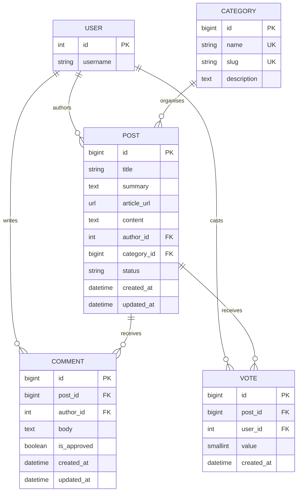

# Database Design

ByteBoard uses Django's built-in user model for authentication and ownership. Four application models represent the news domain: `Category`, `Post`, `Comment`, and `Vote`.

SQLite is used for local development. PostgreSQL is intended for production; deployment configuration is outside Phase 1. The design therefore uses Django field types and database constraints that are portable across both databases.

## Entity-relationship diagram

`UK` denotes a uniqueness rule. The vote entity also has a composite unique constraint on `(post_id, user_id)` and a check constraint limiting `value` to `-1` or `1`.

## Category

| Field | Django type | Rules |
| --- | --- | --- |
| `name` | `CharField` | Required and unique |
| `slug` | `SlugField` | Required and unique |
| `description` | `TextField` | Required |

Categories use alphabetical default ordering by `name`. The initial planned records are Artificial Intelligence, Startups, Software Development, Cybersecurity, Gadgets, and Fintech. They are content records rather than hard-coded choices so staff can manage the taxonomy later.

## Post

| Field | Django type | Rules |
| --- | --- | --- |
| `title` | `CharField` | Required |
| `summary` | `TextField` | Required |
| `article_url` | `URLField` | Required and URL-validated by forms/model validation |
| `content` | `TextField` | Required |
| `author` | `ForeignKey(User)` | Required; `CASCADE` on user deletion |
| `category` | `ForeignKey(Category)` | Required; `PROTECT` on category deletion |
| `status` | `CharField` | Required; Draft or Published, default Draft |
| `created_at` | `DateTimeField` | Set when created |
| `updated_at` | `DateTimeField` | Updated whenever saved |

Posts use newest-first default ordering by `created_at`. Protecting category deletion prevents an administrator from silently deleting posts when reorganising topics. Author deletion cascades in line with Django's normal owned-content approach; account-deletion policy should be reviewed before public launch.

## Comment

| Field | Django type | Rules |
| --- | --- | --- |
| `post` | `ForeignKey(Post)` | Required; `CASCADE` on post deletion |
| `author` | `ForeignKey(User)` | Required; `CASCADE` on user deletion |
| `body` | `TextField` | Required |
| `is_approved` | `BooleanField` | Required; default `False` |
| `created_at` | `DateTimeField` | Set when created |
| `updated_at` | `DateTimeField` | Updated whenever saved |

Comments use oldest-first default ordering by `created_at`. Cascading post deletion prevents orphaned discussion records. Approval is explicit so a later moderation workflow can decide which comments are public.

## Vote

| Field | Django type | Rules |
| --- | --- | --- |
| `post` | `ForeignKey(Post)` | Required; `CASCADE` on post deletion |
| `user` | `ForeignKey(User)` | Required; `CASCADE` on user deletion |
| `value` | `SmallIntegerField` | Required; `-1` or `1` only |
| `created_at` | `DateTimeField` | Set when created |

Two database constraints protect vote integrity:

1. A check constraint rejects any value other than `-1` and `1`.
2. A unique constraint on `post` and `user` prevents duplicate votes by one user on one post.

Application forms and views should still validate votes for useful feedback, but they cannot replace these database guarantees.

## Relationship and deletion summary

| Parent | Child | Cardinality | On parent deletion |
| --- | --- | --- | --- |
| User | Post | One-to-many | Cascade |
| User | Comment | One-to-many | Cascade |
| User | Vote | One-to-many | Cascade |
| Category | Post | One-to-many | Protect while posts exist |
| Post | Comment | One-to-many | Cascade |
| Post | Vote | One-to-many | Cascade |

## Integrity and migration intentions

- Required relationships remain non-nullable.
- Uniqueness and vote checks are implemented in migrations, not only Python code.
- Model changes must produce reviewed migrations and pass `makemigrations --check`.
- Automated tests use Django's isolated test database and never depend on local `db.sqlite3` records.
- Seed categories may be added through a reviewed data migration in a later phase if the product needs guaranteed initial content; Phase 1 documents them without silently inserting production data.
